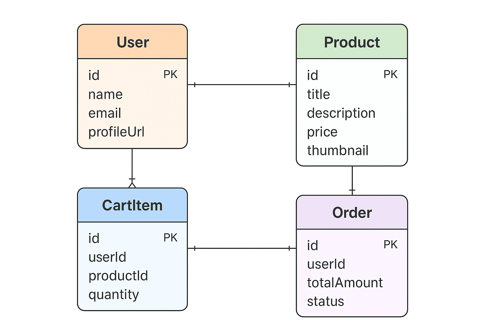
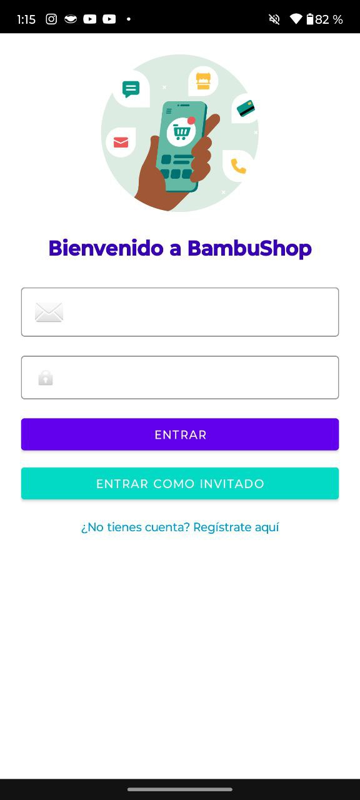
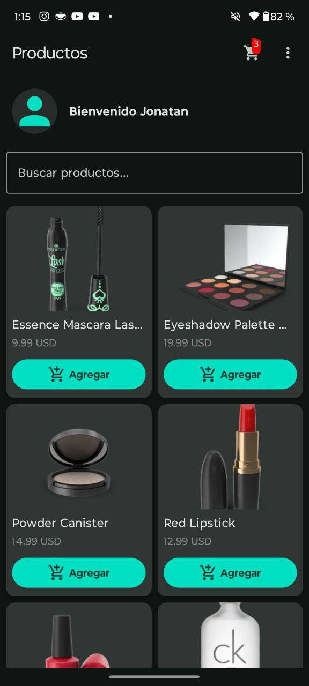
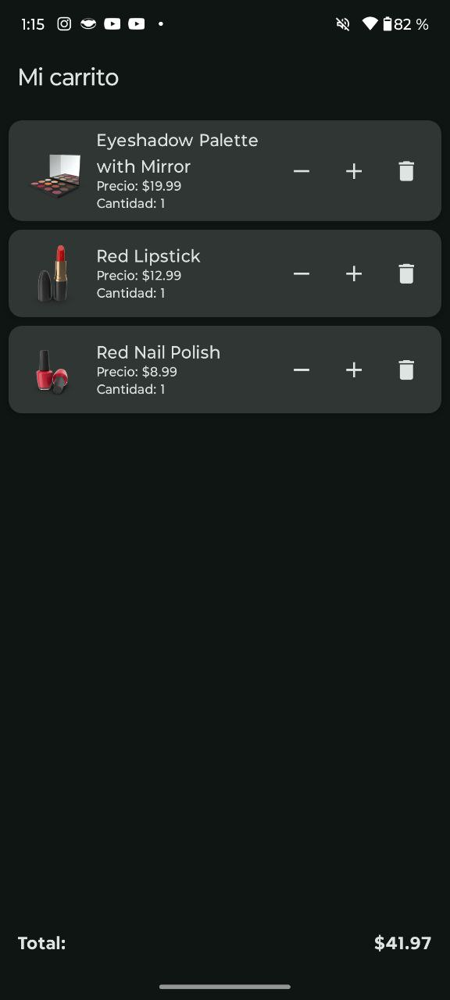

# BambuShop Android App

BambuShop es una aplicación de ejemplo tipo e-commerce desarrollada en **Kotlin** usando **Jetpack Compose** y **Firebase**. Está diseñada para demostrar buenas prácticas en arquitectura, integración con Firebase, manejo de imágenes, autenticación biométrica, y persistencia local.

---

## 📂 Estructura del Proyecto

app/
├─ src/
│ ├─ main/
│ │ ├─ java/com/f8fit/bambutestandroid/
│ │ │ ├─ data/ # Repositorios, DataStore, API, DTO, Dao
│ │ │ ├─ Navigation # AppNavigation, NavRoutes
│ │ │ ├─ presentation/ # Pantallas (Compose + Activities)
│ │ │ │ ├─ homeModule/
│ │ │ │ ├─ loginModule/
│ │ │ │ ├─ registerModule/
│ │ │ │ ├─ profileModule/
│ │ │ │ └─ cartModule/
│ │ │ └─ utils/ # Extensiones, constantes, helpers
│ │ └─ res/ # Layouts, Drawables, Colors, Themes
├─ build.gradle.kts
└─ README.md


---

## ⚙️ Tecnologías y Librerías

- **Kotlin** y **Coroutines**
- **Jetpack Compose**: UI declarativa moderna
- **Material3** y **Material Components** para un diseño moderno
- **Firebase**:
  - Authentication (email/password)
  - Firestore
  - Storage (para fotos de perfil)
  - Analytics
- **Hilt**: Inyección de dependencias
- **Retrofit + OkHttp**: Para consumo de APIs externas
- **Coil**: Carga de imágenes en Compose
- **Paging 3**: Paginación eficiente de productos
- **DataStore Preferences**: Persistencia local de configuraciones y URI de perfil
- **Biometric API**: Login con huella
- **JUnit + MockK**: Pruebas unitarias
- **Espresso + Compose Test**: Pruebas de UI
- **Glide**: Carga y manejo de imágenes en XML

---

## Diagrama ER (Entidad Relacion)



## 📝 Funcionalidades

### Autenticación
- Registro y login con correo y contraseña.
- Login como invitado.
- Login biométrico con huella si está disponible.
- Futuro soporte de reconocimiento facial.

### Perfil de Usuario
- Mostrar información básica del usuario.
- Tomar foto de perfil con cámara y guardar URI local.
- Persistencia de foto usando **DataStore Preferences**.

### Home / Productos
- Lista de productos en **LazyVerticalGrid**.
- Agregar productos al carrito.
- Actualización dinámica del ícono del carrito con número de items.
- Paginación con **Paging 3**.
- Búsqueda de productos.

### Carrito
- Agregar productos con cantidad.
- Actualización de la UI en tiempo real.
- Persistencia simple en memoria (puede adaptarse a Room/Firestore).

### UI / UX
- Uso de **Material3** y **TextInputLayout** para formularios.
- Diseño responsive y consistente.
- Colores y estilos definidos en `colors.xml` y `themes.xml`.

## ScreenShots








## 🛠️ Configuración de Build Variants

El proyecto tiene dos flavors para pruebas y producción:

```gradle
flavorDimensions "env"
productFlavors {
    dev {
        dimension "env"
        buildConfigField "String", "BASE_URL", '"https://dummyjson.com/\"'
    }
    prod {
        dimension "env"
        buildConfigField "String", "BASE_URL", '"https://dummyjson.com/\"'
    }
}

Developer: Jose Jonatan Islas Austria